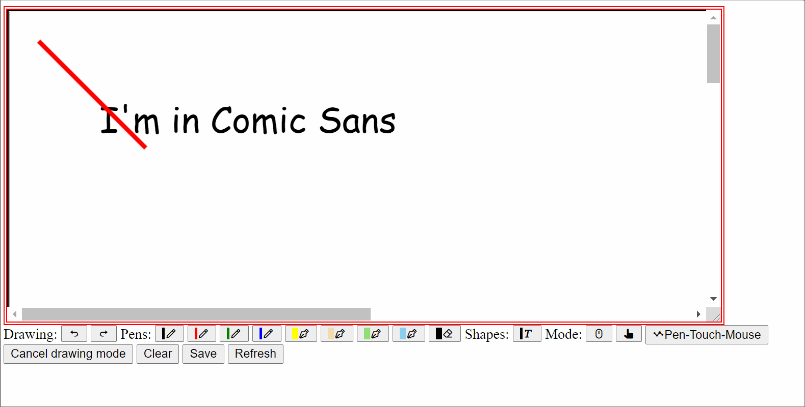

# infinite-drawing-canvas
Infinite canvas that allows drawing with pen and pinch zoom. It should feel more ore less like drawing in an app like OneNote, Krita or other, pen-enabled apps.

Demo

## Features:

* Resizable Canvas
* Infinite Canvas*
* Pan Canvas to all sides
* Pan with Touch (Hammer.js) or ALT+Moues
* Pinch zoom (Hammer.js)
* Draw with Mouse / Touch / Pen
* Add Text
* Erase custom path (known issue: Resolution suffers... :-/)

\* Actually one can define how big it is. In the demo it is 1500x1500px, way bigger than the visible area. Resultion of paths drawn depend on the scaling factor..., so infinite in fact is an overstatement.

## Roadmap

* Style Text
* Add Links to Text, clickable with Mouse or Touch
* Add basic shapes (Rectangle, Circle, Line, Ellipse, Star?)
* Erase whole object (existing path)
* Work on "infinity" (see \*)

# Credits

* Fabric.js - Awesome canvas library with great documentation

# Prior Art

* Infinite canvas with drag and zoom with fabric.js: http://fabricjs.com/fabric-intro-part-5
* Add scrollbars to canvas: https://stackoverflow.com/questions/22742067/how-to-add-scrollbars-to-a-potentially-infinite-canvas-using-fabric-js/22792461
* Free Drawing fabric.js: http://fabricjs.com/freedrawing
* Pen Support in browser: https://patrickhlauke.github.io/touch/tracker/multi-touch-tracker-pointer-hud.html
* Minimalistic Shapes Editor: https://github.com/danielktaylor/fabric-js-editor
* React: Diagramming with react and fabric.js: https://github.com/salgum1114/react-design-editor
* Samples of Text-Editing: https://jsfiddle.net/gislef/Lvfpq57h/
* PoC of Connectors and Ports for Diagrams with fabric: https://robferguson.org/blog/2016/01/21/adding-support-for-ports-and-connectors-to-fabric-js/
  * https://github.com/Robinyo/my-2d-diagram-editor
* 
